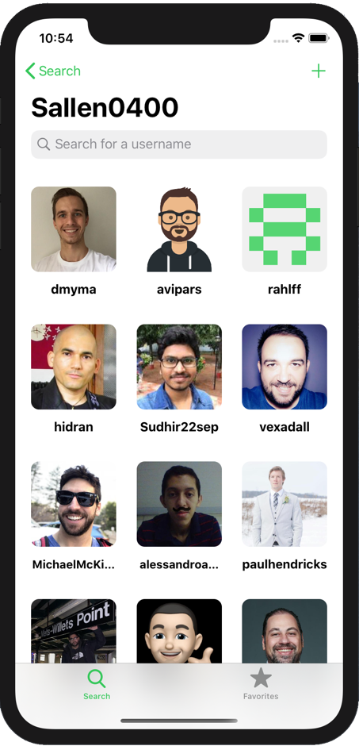
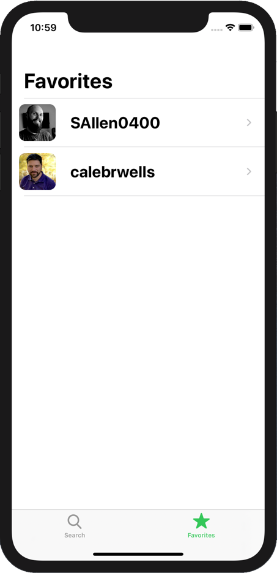
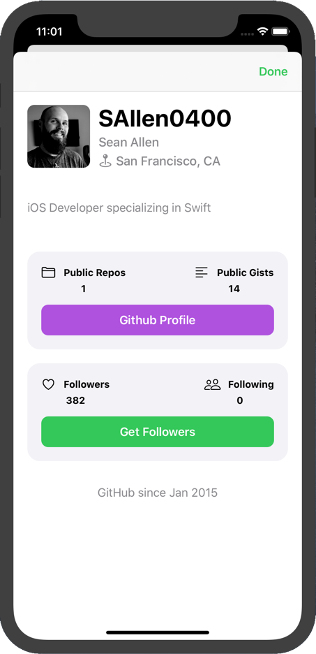

# GHFollowers
Simple Github iOS app for viewing Github users, their followers, and adding favorites.
This project was built following [Sean Allen's course](https://github.com/SAllen0400).
This is my very first Github Project! 

# Changes
I modified the favorites screen to popup the UserInfoVC when a person is selected.
This allows you to view their profile or choose to check their followers.

# Image Previews

